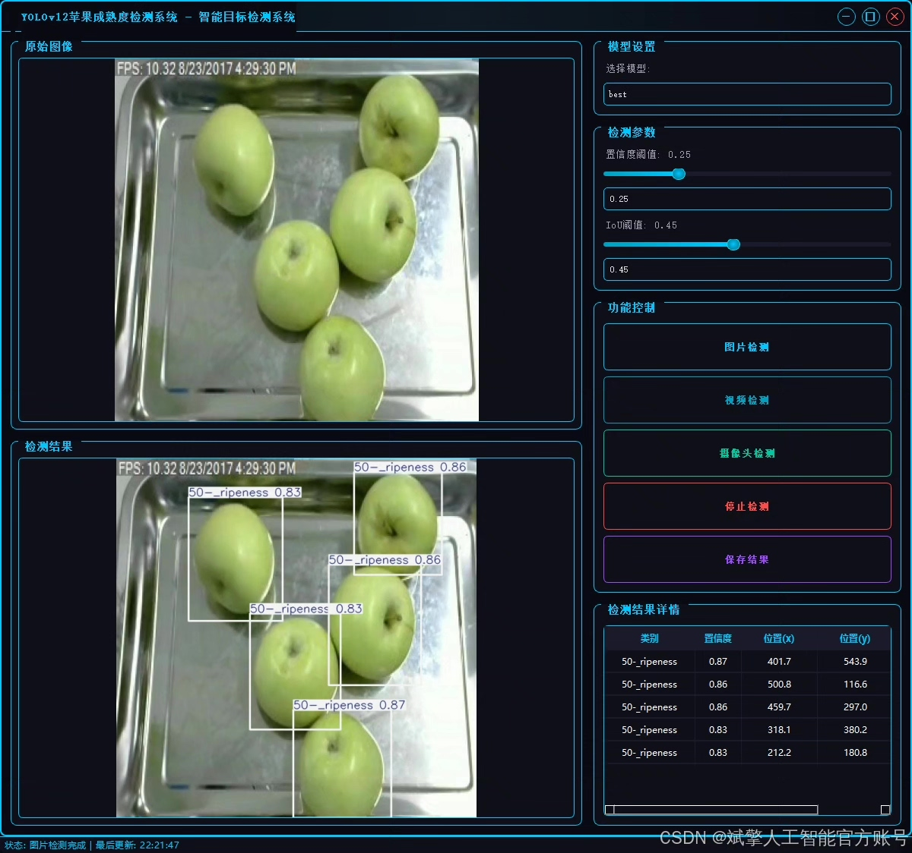
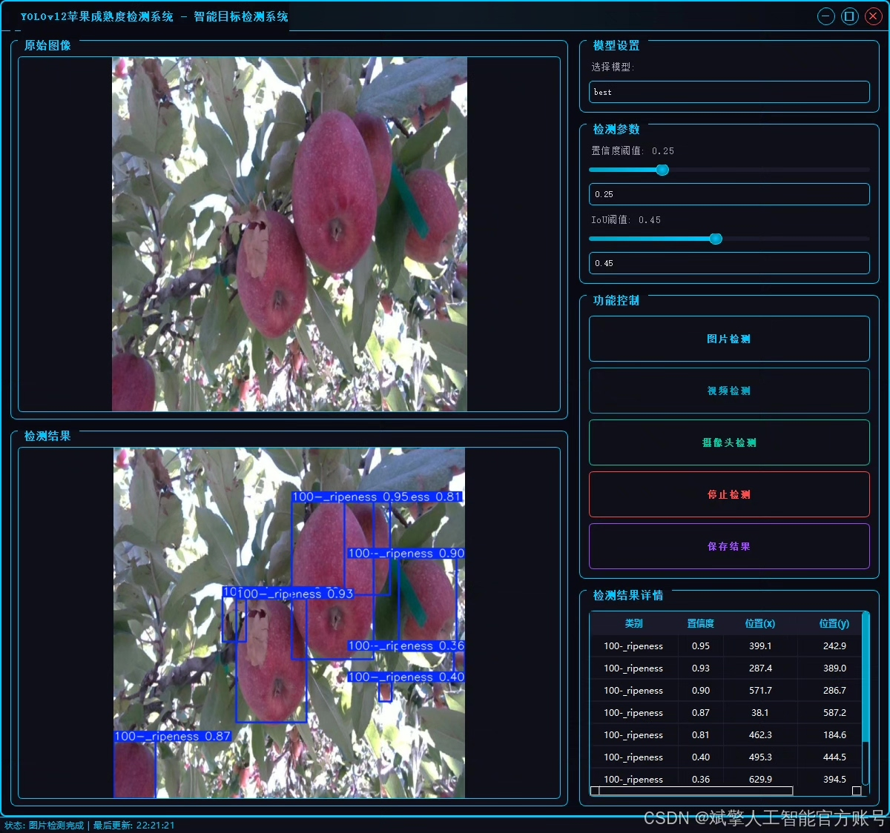
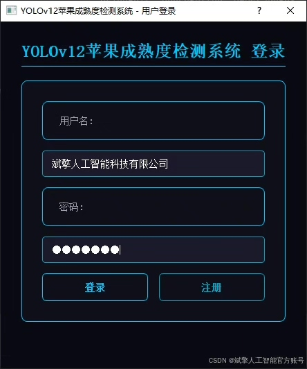
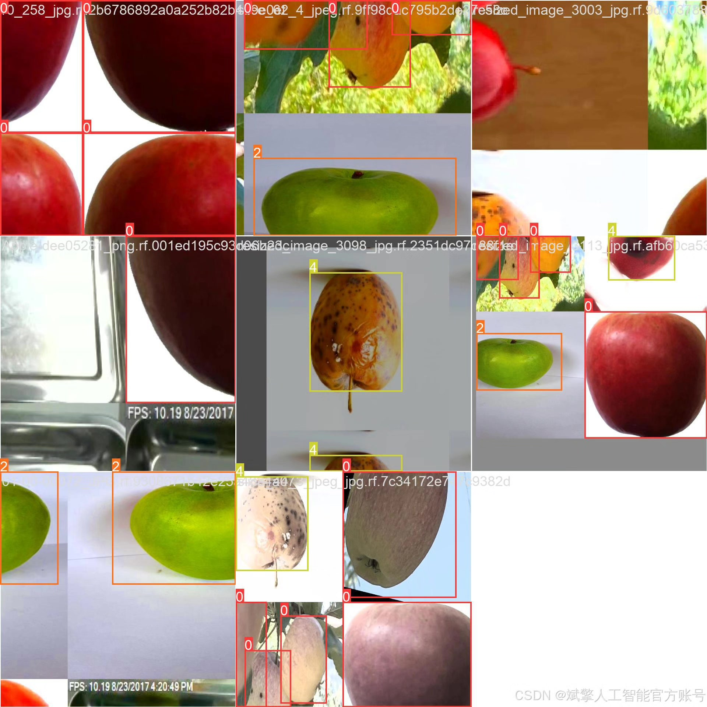
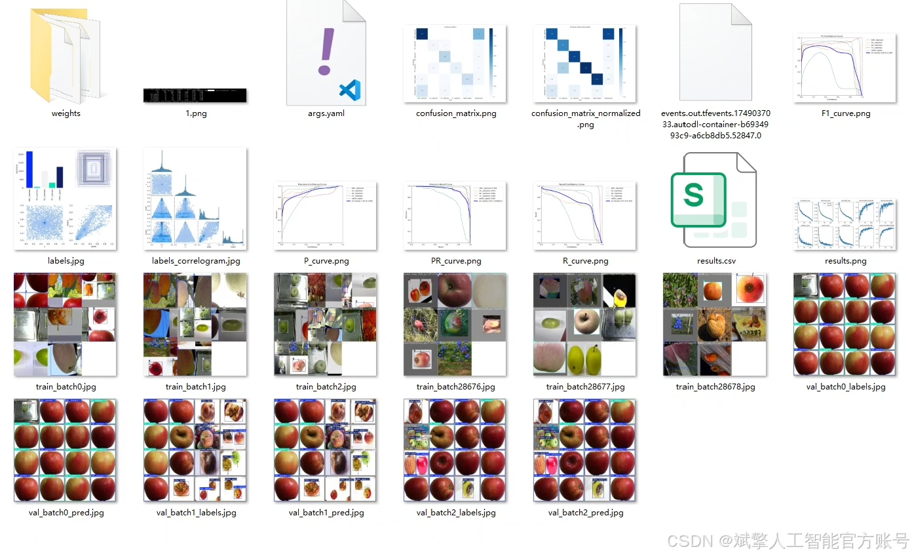
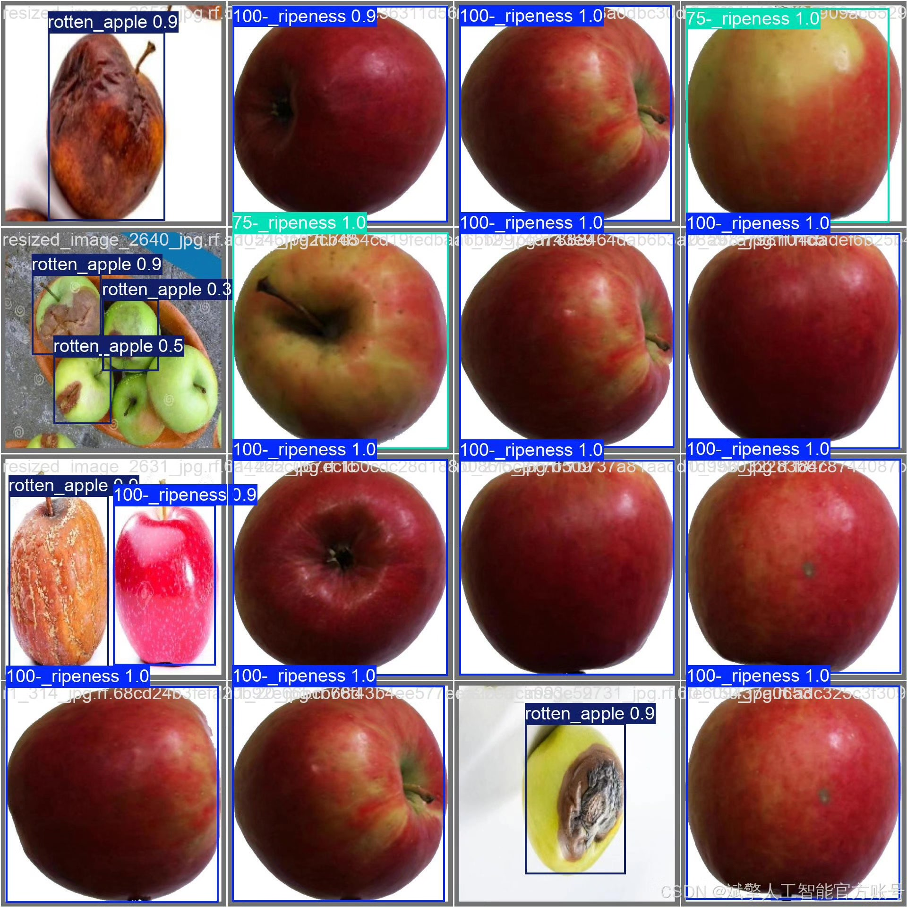

# YOLOv12 Apple Maturity Recognition System

## Body

YOLOv12 Apple Maturity Detection System Based on Deep Learning YOLOv12: An Apple Maturity Detection System (YOLOv12+YOLO dataset + UI interface + login and registration interfaces + Python project source code + model)

This paper proposes a deep learning-based apple maturity detection system based on YOLOv12. This system can efficiently and accurately identify the maturity levels of apples (including 20%, 50%, 75%, 100% ripe and rotten states). The system employs the YOLOv12 object detection algorithm, combined with a custom YOLO format dataset (containing 2144 training images, 359 validation images, and 225 test images), to achieve high accuracy in maturity classification. Additionally, the system is equipped with a user-friendly UI interface that supports login and registration functions.

✅ User Login and Registration: Supports password verification and security authentication.
✅ Three Detection Modes: Based on the YOLOv12 model, supporting image, video, and real-time camera detection for precise target recognition.
✅ Dual-Screen Comparison: Displays the original image and detection results side by side on the screen.
✅ Data Visualization: Real-time table displaying the category, confidence, and coordinates of detected targets.
✅ Intelligent Parameter Tuning: Offers a confidence slide bar to dynamically optimize detection accuracy, adapting to different scene requirements.
✅ Sci-Fi Style Interactive Interface: Dark theme paired with dynamic light effects to reduce visual fatigue and enhance operational experience.

## Images

## Payment

Here is a pay link on Stripe ( https://buy.stripe.com/3cs8yP7sY87d0vu9AB ). Please contact me lonlonago@foxmail.com after funding $89, and I will send you a complete data files , thank you!

